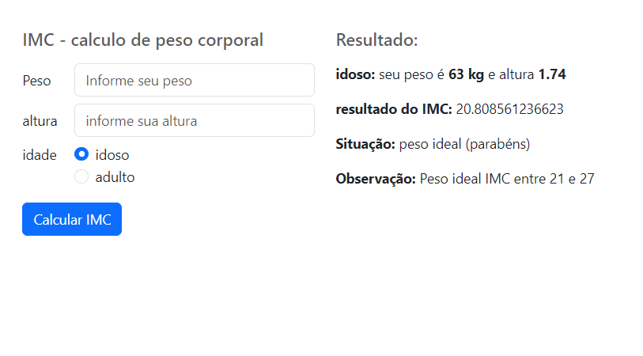
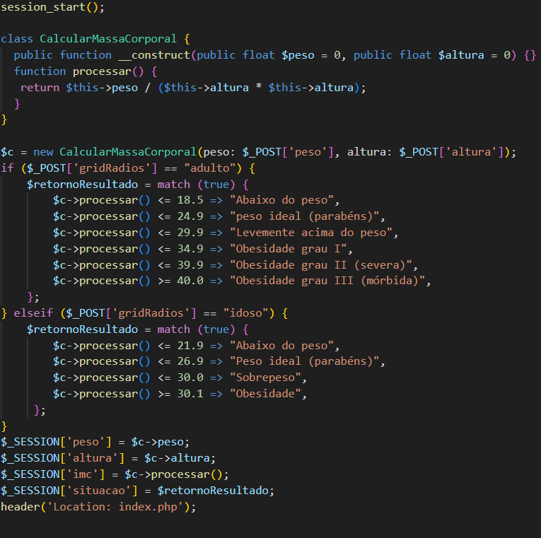

# Calculadora-imc-php

Criei esse app com objetivo de treinar o conhecimento adquirido, utilizei PHP orientação a objetos e novas features do PHP 8

<h2>Resultado: </h2>

<h2>Código: </h2>

<h2>Lingugens: </h2>

~HTML

~PHP

~CSS

<h2>framework: </h2>

~Bootstrap
